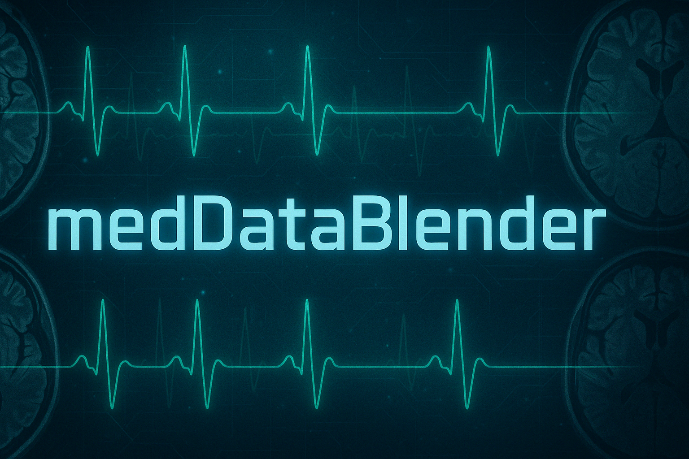
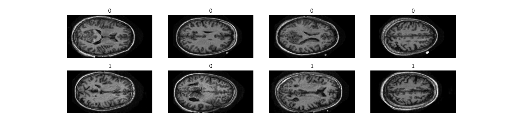
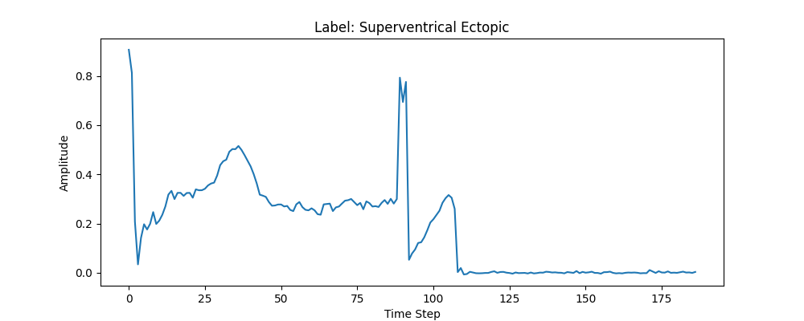

**


# 1. medDataBlender

Il framework medDataBlender è progettato per la generazione di dati medici sintetici, con il supporto previsto per dati tabulari, immagini (MRI, RX, ecc.) e serie temporali (ECG, EEG, ecc.).
Il framework può lavorare in modalità centralizzata, oppure essere utilizzato per creare nodi client e server per un ambiente di training distribuito basato su Federated Learning.

Questa versione del progetto è focalizzata sulla sperimentazione con immagini MRI e segnali ECG.
In particolare:

Il dataset utilizzato per il training delle immagini MRI è il dataset pubblico OASIS, disponibile su Kaggle: OASIS dataset

Il dataset utilizzato per il training dei segnali ECG segue la struttura del Heartbeat Dataset, disponibile su Kaggle: Heartbeat Dataset - Kaggle

I moduli di caricamento e pre-processing dei dati sono progettati specificamente per questi due dataset.
L'utilizzo di dataset con strutture differenti richiede lo sviluppo di ulteriori moduli di data loading dedicati.
Pertanto, il framework in questa versione è verticalizzato sui due casi d'uso scelti per la sperimentazione del progetto.

Il repository fornisce tutto il necessario per riprodurre l’intero ciclo sperimentale su entrambi i dataset:

Addestramento dei modelli

Generazione dei dati sintetici

Costruzione automatica di un report di valutazione

Tutte queste funzionalità sono disponibili sia in modalità centralizzata, sia in modalità distribuita (Federated Learning).

## 1.1 Struttura del progetto

```
📂 synthetic_med_models
├── pyproject.toml
├── poetry-gpu.lock
├── poetry-cpu.lock
├── blenderLauncher.py
├── generateClientsDataMRI.py
├── generateReport.py
├── run_fed_learning_sim.sh
├── img/
└── medDataBlender/
    ├── __init__.py
    ├── launcher_args.py
    ├── fedLearning/
    │   ├── __init__.py
    │   ├── eHealthClient.py
    │   └── eHealthServer.py
    ├── models/
    │   ├── __init__.py
    │   ├── acgan.py
    │   ├── baseModel.py
    │   ├── tts_gan.py
    │   ├── dataLoaders/
    │   │   ├── __init__.py
    │   │   ├── baseLoader.py
    │   │   ├── imageLoader.py
    │   │   └── timeSeriesLoader.py
    │   ├── ecg/
    │   │   ├── __init__.py
    │   │   ├── adamw.py
    │   │   └── tts_gan_components.py
    │   ├── evaluator/
    │   │   ├── ImageEvaluator.py
    │   │   ├── SyntheticDataEvaluator.py
    │   │   ├── TimeSeriesEvaluator.py
    │   │   └── __init__.py
    │   └── mri/
    │       ├── __init__.py
    │       ├── acgan_components.py
    │       └── acgan_components_with_residuals.py
    └── validationReport/
        ├── MetricsDB.py
        ├── __init__.py
        ├── reportBuilder.py
        ├── report_args.py
        ├── classificator_models/
        │   ├── __init__.py
        │   ├── image_classification.py
        │   └── timeSeries_classification.py
        ├── medImg/
        └── privacyMetrics/
            ├── __init__.py
            ├── k_anonimity.py
            └── mia.py
 
```

## 1.2 Overview degli elementi del progetto


### 📄 `blenderLauncher.py`
Punto d'ingresso principale del progetto. Permette:
- il **training centralizzato**
- la **generazione diretta di dati sintetici**
- l’**avvio di una simulazione federata** (come server o client)

### 📄 `generateClientsDataMRI.py`
Script per partizionare un dataset MRI in sottocartelle, ciascuna destinata a un nodo client per simulazioni federate locali.

### 📄 `generateReport.py`
Fornisce all’utente un'interfaccia per costruire un report valutativo, utilizzando il modulo `validationReport`.

### 📄 `run_fed_learning_sim.sh`
Script bash che lancia una simulazione federata locale, istanziando un server e due client tramite `blenderLauncher`.

### 📁 `img/`
Contiene immagini illustrative utilizzate nella documentazione (es. README.md).

---

## 📁 `medDataBlender/`
Libreria principale del progetto.

### 📄 `launcher_args.py`
contiene gli args per lo script di launcher blenderLauncher.py

### 📁 `fedLearning/`
Contiene la logica per l'apprendimento federato:
- **`eHealthServer.py`**: definisce il comportamento del nodo server.
- **`eHealthClient.py`**: definisce il comportamento del nodo client.

### 📁 `models/`
Contiene l’implementazione delle GAN, dei data loader e dei moduli di valutazione.

#### 📄 `acgan.py` / `tts_gan.py`
Definiscono i **cicli di training** e le **funzioni di perdita** dei rispettivi modelli GAN.

#### 📄 `baseModel.py`
Classe astratta di base per tutti i modelli GAN.

#### 📁 `dataLoaders/`
Moduli per caricare diverse tipologie di dati:
- `baseLoader.py`: struttura generica di un loader
- `imageLoader.py`: per dati immagine (es. MRI)
- `timeSeriesLoader.py`: per segnali temporali (es. ECG)

#### 📁 `ecg/`
Componenti specifici per GAN su segnali ECG:
- `adamw.py`: implementazione di un ottimizzatore
- `tts_gan_components.py`: definizione del generatore e discriminatore per ECG

#### 📁 `mri/`
Componenti specifici per GAN su immagini MRI:
- `acgan_components.py` e `acgan_components_with_residuals.py`: definizione delle architetture GAN (standard e con residuals)

#### 📁 `evaluator/`
Valutatori per dati sintetici:
- `SyntheticDataEvaluator.py`: wrapper generico che confronta reali vs sintetici
- `ImageEvaluator.py`: metriche per immagini
- `TimeSeriesEvaluator.py`: metriche per segnali

---

### 📁 `validationReport/`
Modulo dedicato alla **costruzione dei report finali**. Analizza i dati sintetici sotto tre aspetti:
- **Qualità statistica**
- **Privacy**
- **Utilità/Usabilità** per compiti medici downstream

## 1.3 🔧 Installation

Questo progetto fornisce due versioni di lock file per facilitare l'installazione in ambienti con o senza GPU.

### Requisiti:

* Python ≥ 3.10

* Poetry = "2.1.1"

se si vuole usare l'accellerazione GPU è necessario:

* Driver NVIDIA >= 515.x

* Toolkit CUDA 11.7

### ⚙️ Scegli la versione adatta

💻 Se non hai una GPU (versione CPU), puoi semplicemente installare tutte le dipendenze con:

```
poetry install

```
Questo installerà le versioni CPU di torch e torchvision (necessario per la risoluzione iniziale del lockfile).

🧠 Se hai una GPU compatibile con PyTorch (versione GPU):
Assicurati che i driver NVIDIA e CUDA siano correttamente installati.

```
poetry install
```

e poi installa le versioni corrette di torch e torchvision per CUDA con:

```
pip install --no-cache-dir torch==2.0.1+cu117 torchvision==0.15.2+cu117 \
    -f https://download.pytorch.org/whl/torch_stable.html
```
Questo comando scarica le versioni GPU direttamente dal repository ufficiale di PyTorch e sovrascrive quelle CPU.
Puoi verificare se PyTorch vede correttamente la tua GPU con:

```
python -c "import torch; print(torch.__version__); print(torch.cuda.is_available())"
```

### Note

Installare la versione GPU di PyTorch (torch e torchvision) su una macchina che non ha GPU funziona comunque. PyTorch è costruito in modo che la versione GPU includa anche il supporto per CPU, quindi se CUDA non è disponibile, utilizzerà la CPU automaticamente.

Svantaggi dell'usare la versione GPU su una macchina solo CPU:

* Maggiore dimensione dei pacchetti
Le versioni GPU includono le librerie CUDA, quindi sono più pesanti (possono superare 1 GB).

* Avvio più lento
L'importazione dei moduli può richiedere più tempo, perché vengono eseguiti controlli sulla disponibilità della GPU e dei driver CUDA.

  
# 2. Generazione Dati Sintetici

Le Generative Adversarial Networks (GAN) rappresentano una delle tecniche più avanzate per la generazione di dati sintetici, inclusi immagini mediche come radiografie o risonanze magnetiche (MRI). In un approccio centralizzato, il modello viene addestrato su un dataset raccolto in un unico nodo, senza restrizioni sulla condivisione dei dati reali.

Il processo di generazione si basa su due reti neurali contrapposte: il Generatore, che crea immagini realistiche a partire da rumore casuale, e il Discriminatore, che valuta la loro autenticità rispetto a immagini reali. L'addestramento avviene attraverso un gioco minmax in cui il generatore cerca di ingannare il discriminatore, migliorando progressivamente la qualità delle immagini sintetiche.
## 2.1 Generazione Sintetica Centralizzata

Nel paradigma centralizzato, tutti i dati reali (ad esempio MRI o segnali ECG) vengono raccolti in un unico punto (solitamente un server centrale).
### 2.1.1 MRI

*Figura 1: Esempio di MRI del cervello generate dal framework. Le immagini etichettate con 0 appartengono alla classe Non_Demented, mentre con 1 le Very_mild_Dementia*

Le immagini MRI (Magnetic Resonance Imaging, o Risonanza Magnetica) sono immagini mediche ottenute usando campi magnetici e onde radio per visualizzare in dettaglio organi, tessuti e strutture interne del corpo. Sono particolarmente utili per analizzare il cervello, la colonna vertebrale, le articolazioni e i tessuti molli, senza l’uso di radiazioni ionizzanti come nei raggi X o nella TAC.

Il dataset utilizzato per il training è il dataset MRI disponibile su Kaggle: [OASIS dataset](https://www.kaggle.com/datasets/ninadaithal/imagesoasis/data?select=Data).
Questo dataset contiene immagini MRI di pazienti con diverse livelli di condizione cognitive. Attualmente le nostre sperimentazioni si focalizzano su due livelli: Non_Demented e Very_mild_Dementia.

Quando si esegue una risonanza magnetica (MRI) del cervello, l'acquisizione delle immagini avviene in sezioni o layer successivi, che rappresentano tagli orizzontali del cervello a diverse profondità. Ogni layer mostra una "fetta" del cervello, permettendo una visualizzazione dettagliata della sua struttura interna lungo l'asse assiale (dall'alto verso il basso).
Nel nostro esperimento ci siamo focalizzati sui primi 10 layer per ogni paziente reale, cioè le sezioni più superficiali della scansione. Questi layer rappresentano le porzioni iniziali del cervello acquisite durante l'MRI, e sono particolarmente rilevanti per l'analisi delle strutture corticali. L'obiettivo è stato quello di generare immagini sintetiche fedeli a queste prime sezioni, mantenendo una qualità comparabile ai dati reali.

la struttura del Dataset OASIS MRI

```
OASIS_MRI/Data/
│-- Mild_Dementia/
│-- Moderate_Dementia/
│-- Non_Demented/
│-- Very_mild_Dementia/
```
Ogni sotto directory contiene immagini MRI corrispondenti alla rispettiva classe.
Nel caso si volesse eseguire un training su di un nuovo dataset di immagini MRI sarà necessario che il dataset abbia sempre la seguente struttura:

```
dataset_dir/
│-- class1/
│-- class2/
│-- class3/
│-- class4/
│-- ...
│
│-- classN/
```

#### 2.1.1.1 Training MRI

Per eseguire un training centralizzato del modello ACGAN su immagini MRI (es. dal dataset OASIS), usa il seguente comando:

```
python blenderLauncher.py centralized --data_type mri --data_path /percorso/al/dataset/OASIS
```

📌 Argomenti principali
+ --data_type: Fondamentale per indicare al framework la tipologia di dati in uso (mri o ecg).
Attualmente è un argomento obbligatorio, ma verrà automatizzato in futuro per una migliore esperienza d’uso.

+ --data_path: Percorso alla cartella contenente i dati. Va sempre specificato.

Tutti gli altri argomenti sono già settati con valori ottimali per il dataset OASIS, quindi possono essere omessi a meno che non si stia lavorando con un dataset differente.

📦 Parametri utili (MRI)
+ --data_path: (richiesto) percorso alla directory contenente i dati.

+ --classes: nomi delle classi. Default: ["Non_Demented", "Very_mild_Dementia"]

+ --image_shape: shape dell'immagine (H, W). Default: (256, 256)

+ --channels: numero di canali. Default: 1

+ --batch_size: dimensione del batch. Default: 10

🧪 Opzioni avanzate
+ --only_generation True: salta il training e genera solo immagini.

+ --weights_path: carica i pesi di un modello preaddestrato.

+ --out_dir_samples: directory dove salvare i campioni generati. Default: None  Se lasciato di default non farà la generazione dei samples una volta finito il training

+ --num_samples: numero di immagini da generare per classe. Default: 100

⚙️ Parametri di training (modifica solo se necessario)
+ --epochs: numero di epoche. Default: 50

+ --eta: learning rate. Default: 0.0002

+ --weight_decay: weight decay. Default: 6e-9

+ --latent_dim: dimensione spazio latente. Default: 256

+ --checkpoint_epoch: ogni quante epoche salvare un checkpoint. Default: 1


#### 2.1.1.2 Generazione dati sintetici MRI

Se possiedi un dataset di partenza e desideri generare sample sintetici mantenendo la distribuzione delle classi, puoi usare il parametro data_path per fornire il percorso del dataset.

```
 python blenderLauncher.py centralized --only_generation True --data_type mri --data_path /path/to/your/dataset --out_dir_samples /path/so/save/smples --weights_path ../path/to/your/model/weights --classes Non_Demented Very_mild_Dementia --num_samples 1000
```

dove:

+ --data_type mri: Specifica il tipo di dati, in questo caso immagini MRI.

+ --data_path /path/to/your/dataset: Il percorso al tuo dataset di partenza.

+ --classes Non_Demented Very_mild_Dementia: Le classi per cui vuoi generare i sample sintetici.

+ --num_samples 1000: Numero totale di sample sintetici da generare.

+ --out_dir_samples: directory dove salvare i campioni generati. Default: ./out_samples

+ --only_generation True: salta il training e genera solo immagini.

Se non vuoi usare un dataset esistente o preferisci avere il pieno controllo sulla distribuzione dei campioni per classe, puoi specificare manualmente la percentuale di sample da generare per ciascuna classe.

```
python blenderLauncher.py centralized --data_type mri --only_generation True --weights_path ../path/to/your/model/weights --classes Non_Demented Very_mild_Dementia --num_samples 1000 --num_samples_per_classes "Non_Demented:60,Very_mild_Dementia:40"
```

+ --num_samples_per_classes Non_Demented:60 Very_mild_Dementia:40: Percentuali per ciascuna classe. In questo caso, il 60% dei campioni sarà per la classe Non_Demented e il 40% per la classe Very_mild_Dementia.

### 2.1.2 ECG


*Figura 2: Esempio di sequenza ECG generata dal framework.*

Il dataset di training deve essere un file .csv contenente i segnali ECG e le relative etichette.
Il file CSV deve essere organizzato nel seguente formato:
- Ogni timestamp della sequenza ECG deve essere salvato in una colonna specifica.
- La classe di appartenenza deve essere inserita nell'ultima colonna.
Questa organizzazione segue la struttura del dataset disponibile su Kaggle: [Heartbeat Dataset - Kaggle](https://www.kaggle.com/datasets/shayanfazeli/heartbeat?resource=download)

Questo dataset è una versione ridotta del PTB-XL, in quanto ci siamo focalizzati su ECG a singola derivazione, quindi con sequenze univariate, mentre il PTB-XL contiene 12 derivazioni, rendendo le sequenze multivariate. Il metodo attuale può essere esteso per gestire sequenze multivariate, ma richiederebbe una maggiore potenza computazionale.

#### 2.1.1.1 Training ECG

```
python script_name.py centralized --data_type ecg --data_path <path_to_ecg_data.csv>
```

i seguenti valori sono stati impostati in base ai valori ottimali ottenuti durante le sperimentazioni:
+ --seq_len (default: 187)
Lunghezza della sequenza ECG. Rappresenta il numero di campioni in un singolo segmento di input (es. un battito cardiaco).
Es: una sequenza di 187 punti temporali.

+ --data_embed_dim (default: 10)
Dimensione dell'embedding per i dati ECG. Ogni punto della sequenza verrà proiettato in uno spazio vettoriale di questa dimensione.

+ --label_embed_dim (default: 10)
Dimensione dell'embedding per le etichette di classe, utile nei modelli condizionati (es. GAN condizionate).

+ --depth (default: 3)
Profondità del modello, ad esempio il numero di layer nel trasformatore o nella rete neurale.

+ --num_heads (default: 5)
Numero di "teste" di attenzione nel meccanismo multi-head attention del trasformatore.

+ --forward_drop_rate (default: 0.5)
Tasso di dropout applicato nella parte feedforward del modello, per ridurre l'overfitting.

+ --attn_drop_rate (default: 0.5)
Tasso di dropout applicato ai pesi di attenzione. Aiuta a regolarizzare il meccanismo di attenzione.

+ --classes (default: [ "Non-Ectopic Beats", "Superventrical Ectopic", "Ventricular Beats", "Unknown", "Fusion Beats" ])
Lista delle classi presenti nel dataset ECG. Serve per la classificazione o per il conditioning nella generazione.

+ --latent_dim (default: 100) Dimensione dello spazio latente utilizzato ad esempio in GAN o autoencoder. Rappresenta la dimensionalità del vettore casuale in input al generatore.


Nel dataset ECG Heartbeat Categorization, la classe "unknown" (indicata come "Q") si riferisce a battiti cardiaci non classificabili o a battiti stimolati da pacemaker. 

#### 2.1.1.1 Generazione dati sintetici ECG
La generazione dei dati sintetici ECG segue la stessa logica utilizzata per le immagini MRI, semplicemente cambiando il --data_type


## 2.2 Generazione Sinetetica Federata

Il Federated Learning (FL) è un paradigma di addestramento distribuito in cui i dati rimangono localmente sui dispositivi/client e non vengono mai condivisi. Invece, ogni client addestra localmente una copia del modello e invia solo i pesi aggiornati al server centrale, che li aggrega per migliorare il modello globale.
Nel contesto della generazione sintetica:

+ Ogni client allena il generatore sui propri dati privati.

+ Il server raccoglie i pesi, li combina (es. media pesata), e aggiorna il modello.

+ Dopo vari round, si ottiene un modello generativo che ha appreso senza accedere direttamente ai dati originali.

Questa modalità è ideale per:

+ Applicazioni in ambito medicale o sensibile.

+ Situazioni in cui i dati non possono lasciare l’ospedale o il dispositivo.

+ Garantire la privacy mantenendo buone prestazioni generative.


### 2.2.1 Creazione nodo Server

Avviare il server in una configurazione di apprendimento federato su dati MRI o ECG. Il server:

+ Riceve pesi dai client.

+ Aggrega i modelli.

+ Li redistribuisce ai client nei round successivi.

```
python blenderLauncher.py server \
    --data_type mri \
    --host 0.0.0.0 \
    --send_port 6000 \
    --receive_port 6001 \
    --num_clients 5 \
    --num_rounds 10 \
    --base_dir 
```

#### **Argomenti obbligatori per il server**
+ --data_type: Tipo di dati utilizzato dal server. Può essere:

mri per dati di tipo immagini (es. scansioni MRI)

ecg per dati di tipo sequenze (es. segnali ECG)

+ --host: Indirizzo IP o hostname del server federato.

Questo deve essere l'indirizzo del server a cui i client si collegheranno.
Di solito è un indirizzo di rete o 0.0.0.0 per ascoltare su tutte le interfacce di rete della macchina.

+ --send_port: Porta sulla quale il server invia i pesi aggiornati ai client.

Questa porta deve corrispondere alla porta --receive_port che i client usano per ricevere i modelli dal server.

+ --receive_port: Porta sulla quale il server riceve i pesi aggiornati dai client.

Questa porta deve corrispondere alla porta --send_port che i client usano per inviare i pesi al server.

+ --num_clients: Numero di client che il server si aspetta di connettere per il processo di Federated Learning.

Questo parametro deve essere impostato correttamente, in quanto il server attende che tutti i client si connettano e inviino i pesi prima di proseguire con l'aggregazione e la distribuzione dei modelli.

+ --num_rounds: Numero di round di Federated Learning che il server dovrà eseguire.

Ogni round corrisponde a un ciclo di comunicazione tra il server e i client, durante il quale i client addestrano il loro modello e inviano i pesi aggiornati.

#### **Altri argomenti utili** 
+ --base_dir: Directory di base dove il server salverà i modelli aggregati, i checkpoint e altri file di output.
Default: ./base_dir


### 2.2.2 Creazione nodo Client

```
python blenderLauncher.py client \
  --client_id 0 \
  --data_type ecg \
  --data_path ./data/ecg/client_0 \
  --host 192.168.1.10 \
  --send_port 6000 \
  --receive_port 6001
```

#### **Argomenti obbligatori:**
+ --client_id: ID numerico univoco del client (es. 0, 1, 2, ...)

+ --data_type: Tipo di dato, può essere mri o ecg

+ --data_path: Percorso locale ai dati su cui addestrare il modello

#### **Argomenti specifici per la comunicazione con il server:**
+ --host: Indirizzo IP o hostname del server federato.

Di default è localhost, utile per test locali su una sola macchina.
Va specificato l’indirizzo del server reale per l’esecuzione distribuita.

+ --send_port: Porta sulla quale il client invia i pesi aggiornati al server.
Default: 5000

+ --receive_port: Porta sulla quale il client riceve il modello dal server.
Default: 5001

#### **Altri argomenti utili**
+ --base_dir: Directory dove salvare output e checkpoint locali (default: ./base_dir)

### 2.2.3 Simulazione training Fed. Learning in ambiente locale 

Questo script bash permette di eseguire una sperimentazione locale di apprendimento federato utilizzando dati MRI suddivisi in sottodataset, simulando il comportamento di server e client sulla stessa macchina.

#### **1. Requisiti preliminari**

+ Dataset MRI organizzato per classi.

+ Script generateClientsDataMRI.py per dividere il dataset.

#### **2. Preparazione dei dati con generateClientsDataMRI.py**
Per simulare diversi client, puoi suddividere il dataset in più subset mantenendo la struttura a classi.

```
python generateClientsDataMRI.py \
  ../../datasets/OASIS_MRI/Data \
  ../../datasets/OASIS_MRI_splitted \
  0.05 0.55 0.4
```

Questo comando:

+ Prende il dataset dalla directory ../../datasets/OASIS_MRI/Data
+ Crea tre sottodataset nella directory ../../datasets/OASIS_MRI_splitted
+ Ogni subset riceverà rispettivamente il 5%, 55%, e 40% delle immagini (filtrate con suffisso _150.jpg a _160.jpg)

Ogni subset manterrà la struttura class_name/image.jpg.

#### **2. Script di lancio: run_local_federated.sh**

```
#!/bin/bash

DATA_DIR="../../datasets/OASIS_MRI_splitted"
SERVER_BASE_DIR="../server_base"
CLIENTS_BASE_DIR="../clients_base"

export PYTHONPATH=$PYTHONPATH:fedLearning/mri

gnome-terminal -- bash -c "python3 blenderLauncher.py server \
    --data_type mri \
    --data_path '$DATA_DIR/subset_0' \
    --base_dir $SERVER_BASE_DIR \
    --classes Non_Demented Very_mild_Dementia; exec bash"

for i in {1..2}; do
    gnome-terminal -- bash -c "python3 blenderLauncher.py client \
        --data_type mri \
        --data_path '$DATA_DIR/subset_$i' \
        --base_dir $CLIENTS_BASE_DIR/client_base_$i \
        --client_id $i \
        --classes Non_Demented Very_mild_Dementia; exec bash"
done
```

**Funzionalità** 

Apre 3 terminali:

+ 1 per il server federato
+ 2 per i client, ognuno con un subset diverso

Note:

+ I client usano localhost e porte di default per connettersi al server.
+ Il numero di client usati deve coincidere con --num_clients specificato nel server.
+ il numero di round non è stato settato, di default è 5

Parametri chiave del server:

+ --data_path: path al subset usato per il test del server (tipicamente subset_0)

+ --base_dir: directory dove salvare i modelli e log del server

Parametri chiave dei client

+ --data_path: path del subset dati per ciascun client

+ --base_dir: directory dedicata per il client

+ --client_id: ID unico del client (intero)

+ --classes: lista delle classi presenti nel dataset

Con questo setup puoi testare e sviluppare la logica federata completamente in locale, verificando la corretta aggregazione dei pesi e la sincronizzazione tra server e client.

## 2.3 Integrazione con bucket S3

Lo script blenderLauncher.py supporta l’esecuzione anche con i dati e i pesi salvati su un bucket S3. In questo caso, è necessario passare una serie di argomenti specifici per abilitare il caricamento e il salvataggio remoto.

### ⚙️ 2.3.1 Differenza con la modalità classica
Nella modalità classica (--is_s3 False, o assente), il parametro --data_path deve indicare una directory locale contenente i dati già estratti (es. immagini o segnali).

Nella modalità S3 (--is_s3 True), invece, --data_path deve puntare a un file .zip su S3 contenente il dataset, che mantiene la stessa struttura interna attesa nella versione locale (es. cartelle images/, labels/, ecc.).

```
python blenderLauncher.py centralized \
    --data_type mri \
    --data_path s3://nome-bucket/path/al/dataset.zip \
    --is_s3 True \
    --base_dir s3://nome-bucket/path/output/ \
    --weights_path s3://nome-bucket/path/pesi/
```

### 📁 2.3.2 Struttura attesa del file .zip
Il file .zip indicato in --data_path deve contenere i dati già organizzati come nella modalità classica. Ad esempio:

```
dataset.zip
└── class_1/
└── class_n/
    ├── sample1.png
    ├── sample2.png
    └── ...
 
```
oppure per dati ECG:
```
dataset.zip
└── ecg_signals/
    ├── patient001.csv
    ├── patient002.csv
    └── ...
```
Lo script decomprimerà automaticamente il file ZIP in locale prima di procedere con l’esecuzione.


# 3. Report di validazione

Il modulo CreateReport permette di validare dati sintetici generati (es. da GAN) confrontandoli con dati reali in contesti medicali, sia per immagini MRI sia per segnali ECG.


```
python run_validation.py \
    --real_dir path/to/real/train \
    --fake_dir path/to/fake/train \
    --real_test_dir path/to/real/test \
    --fake_test_dir path/to/fake/test \
    --base_dir path/for/saving/ml/mia/weights \
    --data_type mri (or ecg) \
    --num_classes num_classes \

```

Opzionalmente puoi aggiungere:

+ --model_path_fake: usa un classificatore pre-addestrato sui dati fake.

+ --model_path_mia: usa un modello pre-addestrato per attacco MIA.

se questi path non vengono forniti allora il frameowrk eseguirà un training per l'attaccante per la stima dle MIA e per il classificatore per la stima del ML utility.

## 🧪 3.1 Obiettivo
Questo modulo valuta:

1. Qualità dei dati sintetici (realismo e coerenza con i dati reali).

2. Privacy (resistenza ad attacchi Membership Inference).

3. Usabilità in modelli ML (performance di classificazione).


## 📈 3.2 Metriche di Validazione
La validazione avviene su tre livelli:

### 3.2.1. Qualità dei Dati Sintetici
Valuta quanto i dati fake assomigliano a quelli reali:

Per dati MRI:

+ SSIM (Structural Similarity)

+ PSNR (Peak Signal-to-Noise Ratio)

+ MSE (Errore Quadratico Medio)

+ FID (Fréchet Inception Distance)

Per dati ECG:

+ MAE (Errore Assoluto Medio)

+ DTW (Dynamic Time Warping)

+ Pearson (correlazione lineare)

+ Spearman (correlazione monotona)

### 3.2.2 Privacy
Misura il rischio di divulgazione di dati reali:

+ MIA (Membership Inference Attack): Addestra un classificatore per distinguere dati reali e fake. Se l'attacco è efficace, significa che i dati fake contengono troppa informazione sui reali.
Output: Accuratezza dell'attacco. Più è vicino al 50%, migliore è la privacy.

+ k-Anonymity: Conta quante istanze reali sono "vicine" a ogni dato sintetico. Più alto è k, più l'istanza sintetica è indistinguibile.
Output: Distribuzione dei valori di k sulle istanze fake.

### 3.2.3 Usabilità per Modelli ML
Addestra un classificatore sui dati sintetici e ne misura le prestazioni su dati reali (test set).

Se il modello performa bene su dati reali, significa che i dati fake sono utili per addestrare reti robuste.

+ Per MRI si usa una rete tipo ResNet.
+ Per ECG si usa una rete convoluzionale 1D ispirata a ResNet.


